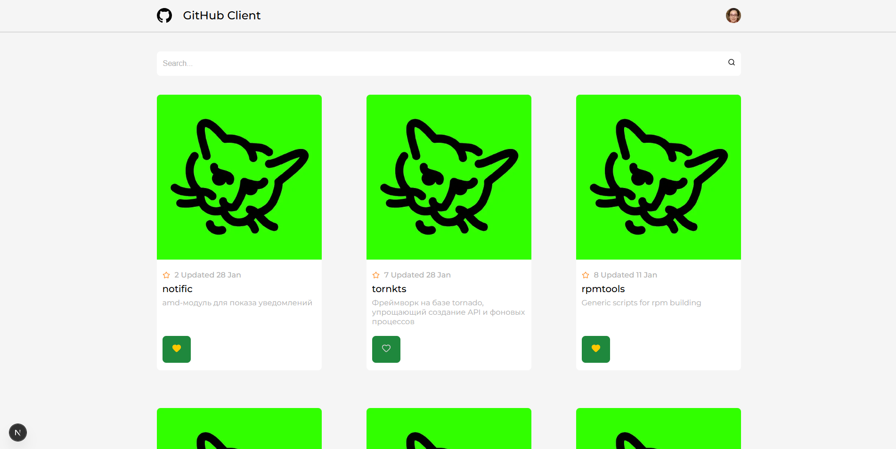

# kts_frontend_project_next

> [!WARNING]
> предпологается что все действия будут происходить из корня проекта

## Клонирование репозитория

```cmd
git clone https://github.com/nais2008/kts_frontend_project_next
cd ./kts_frontend_project_next/
```

## Установка зависимостей

```cmd
npm install
```

## Заполнение переменных среды

### Создание файла

```cmd
touch .env
```

#### Создать токен [здесь (\*тык)](https://github.com/settings/tokens)

### Заполняем

```env
NEXT_PUBLIC_GITHUB_TOKEN=your_github_token
```

## Запуск

```cmd
npm run dev
```

## Вид приложения


